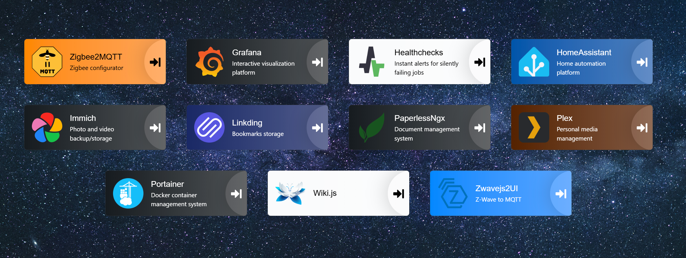

# Dashboard  - [![Badge Kofi]][Kofi]

## Summary

This is a visually [Heimdall](https://github.com/linuxserver/Heimdall) like dashboard which uses [Authelia](https://github.com/authelia/authelia) for authentication and authorization (which can be overridden).



## Usage

### 1. Setup Docker Compose

```yaml
services:
  dashboard:
    image: matrixeler/dashboard:latest
    hostname: dashboard
    container_name: dashboard
    # Only expose the port to your reverse proxy, see "Security" below
    expose:
      - "5000"
    restart: unless-stopped
    volumes:
      - ./user-data:/app/user-data:ro
    healthcheck:
      disable: true
```

The container runs as user id 1000, so the files in `user-data/` must be readable by that user.

Persistent files reside under `user-data/`. The file structure is:

| Path                       | Type | Description                                                                                                               |
| -------------------------- | ---- | ------------------------------------------------------------------------------------------------------------------------- |
| `user-data/`                   | 📂   | holds all persistent data                                                                                                 |
| `user-data/config.yml`         | 🗎    | the config file                                                                                      |
| `user-data/backgrounds/`             | 📂   | image files to use as a background |
| `user-data/icons/`             | 📂   | image files to use as icons in the tiles  |


### 2. Configure the Dashboard

Edit the contents of `user-data/config.yml`. An example can be found [here](./dev/config.yml).
After a config change you have to restart the application.

### Security

The dashboard identifies users by the `Remote-User` and `Remote-Groups` headers set by your reverse proxy after
Authelia's forward auth. Anyone who can reach the dashboard directly can forge these headers, so:

- Don't publish the dashboard's port. Only your reverse proxy should be able to reach it, for example over a Docker
  network as in the example above, or with `ports: ["127.0.0.1:5000:5000"]` if the proxy runs on the host.
- Set `trusted_proxies` in `app_config` to your proxy's address. Then the headers are ignored on requests that don't
  come from the proxy.
- Make sure your proxy replaces any `Remote-User`, `Remote-Groups` and `X-Forwarded-For` headers sent by the client.

The dashboard only decides which tiles are shown. The apps behind the tiles still need their own Authelia protection.

[Kofi]: https://ko-fi.com/dexterandapps
[Badge Kofi]: https://img.shields.io/badge/KO--FI-SUPPORT-orange?style=for-the-badge&logo=ko-fi&logoSize=auto
